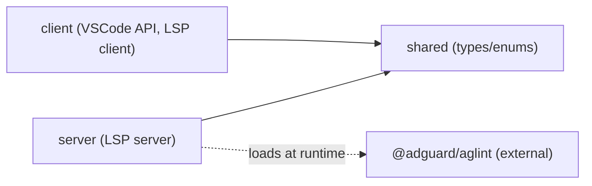

<!-- omit in toc -->
# AGENTS.md

Working reference for AI coding agents (and human contributors) operating in the
VSCode Adblock Syntax monorepo. It describes the conventions to follow, where
program modules live, and how to verify your work.

For environment setup (installing Node, pnpm, recommended extensions, running
the extension in debug mode) see [DEVELOPMENT.md](DEVELOPMENT.md) and
[README.md](README.md). This file does not duplicate setup steps.

<!-- omit in toc -->
## Table of Contents

- [Project Overview](#project-overview)
- [Technical Context](#technical-context)
- [Project Structure](#project-structure)
- [Build And Test Commands](#build-and-test-commands)
- [Contribution Instructions](#contribution-instructions)
- [Code Guidelines](#code-guidelines)
    - [System Design](#system-design)
    - [Architecture](#architecture)
    - [Code Quality](#code-quality)
    - [Testing](#testing)
    - [Dependency Management](#dependency-management)
    - [Configuration \& Documentation](#configuration--documentation)
    - [Markdown Formatting](#markdown-formatting)
    - [Other](#other)
- [Package Agents](#package-agents)

## Project Overview

VSCode Adblock Syntax is a Visual Studio Code extension that adds language
support for ad blocking filter lists (AdGuard, uBlock Origin, AdBlock, and
Adblock Plus syntax). It is a development tool for authoring filter lists, not an
ad blocker.

The extension provides:

- Syntax highlighting via a TextMate grammar.
- Real-time linting, auto-fixing, and platform compatibility checks powered by
  [AGLint](https://github.com/AdguardTeam/AGLint), integrated through the
  Language Server Protocol (LSP).
- Quick fixes and code actions (apply fix, apply suggestion, disable rule).
- Auto-discovery of AGLint installed locally or globally in the workspace.

It is published to the VSCode Marketplace and Open VSX as `adguard.adblock`.

## Technical Context

- **Language/Version**: TypeScript `~5.9` targeting `ESNext`, `module: ESNext`,
  `moduleResolution: bundler`, `strict` mode.
- **Runtime**: Node.js (`>=20`; development uses Node v22). The extension host
  is VSCode `^1.74.0`.
- **Primary Dependencies**: `vscode-languageclient` / `vscode-languageserver`
  (LSP), `@adguard/aglint` and `@adguard/agtree` (linting and AST),
  `vscode-textmate` + `vscode-oniguruma` (grammar testing), `valibot`
  (validation), `fast-glob`, `semver`, `resolve`, `preferred-pm`.
- **Storage**: None. State is in-memory per LSP server process; the only
  persisted artifacts are build outputs and the packaged `.vsix`.
- **Testing**: [Vitest](https://vitest.dev) in every package.
- **Build**: [Rspack](https://rspack.dev) (client, server, shared) and `tsx`
  scripts (syntaxes, tools).
- **Linting**: ESLint (airbnb-base + airbnb-typescript, JSDoc, import,
  boundaries) and markdownlint.
- **Target Platform**: VSCode desktop (extension host on Node.js). Virtual and
  untrusted workspaces are supported with syntax highlighting only.
- **Project Type**: monorepo (pnpm workspaces) of five packages.
- **Performance Goals**: N/A (no formal targets). Linting is debounced (100 ms)
  and results are optionally cached in memory.
- **Constraints**: AGLint linting requires the Node.js filesystem API, so it is
  unavailable in virtual workspaces.
- **Scale/Scope**: Single-developer-machine tool; published to public extension
  registries.

## Project Structure

```text
.
├── package.json                    # Root manifest: extension metadata, contributes, scripts
├── pnpm-workspace.yaml             # Workspace members + dependency version catalog
├── language-configuration.json     # VSCode language config (brackets, comments)
├── tsconfig.base.json              # Shared TypeScript compiler options
├── .eslintrc.cjs                   # Root ESLint config (rules + boundaries)
├── .markdownlint.json              # Markdown lint rules
├── AGENTS.md                       # This file (root agent reference)
├── README.md                       # User-facing documentation
├── DEVELOPMENT.md                  # Environment setup + development guide
├── client/                         # VSCode extension entry (LSP client) — see client/AGENTS.md
├── server/                         # LSP language server (AGLint integration) — see server/AGENTS.md
├── shared/                         # Shared types/utilities for client + server — see shared/AGENTS.md
├── syntaxes/                       # TextMate grammar source, compiler, tests — see syntaxes/AGENTS.md
├── tools/                          # Repo build/utility scripts — see tools/AGENTS.md
├── test/static/                    # Static fixtures (sample rules, aglint test workspace)
├── icons/                          # Extension icons
├── Dockerfile                      # Multi-stage CI image (test-output / build-output .vsix)
├── DEPLOYMENT.md                   # Release pipeline, secrets, Docker targets
└── .github/workflows/              # CI, prepare-release, publish-release, mirror
```

Each package has its own `AGENTS.md` with package-specific structure and
guidelines (see [Package Agents](#package-agents)).

## Build And Test Commands

Run from the repository root unless noted. The package manager is pnpm v10.

- **Build all**: `pnpm build` (recursive, production mode with minification).
- **Test all**: `pnpm test` (recursive Vitest, single run).
- **Type-check all**: `pnpm test:compile` (recursive `tsc --noEmit`).
- **Lint all**: `pnpm lint` (recursive ESLint + markdownlint).
- **Lint code only**: `pnpm lint:code` (ESLint with cache).
- **Lint Markdown only**: `pnpm lint:md` (markdownlint).
- **Clean**: `pnpm clean` (removes generated files / `node_modules`).
- **Package extension**: `pnpm package` (produces `out/vscode-adblock.vsix`);
  `pnpm package:pre` for a pre-release build.
- **CI in Docker**: `docker build --target test-output .` (typecheck, lint,
  test, build); `docker build --target build-output --build-arg VERSION=… --output ./artifacts .`
  for the `.vsix`. See [DEPLOYMENT.md](DEPLOYMENT.md).

Root `package.json` has **no `version` field** — CI injects it from
`CHANGELOG.md` before packaging (`vsce` requires a version). Local packages
need `npm pkg set version=…` or the Docker `VERSION` build arg.

Per-package commands use workspace filters, e.g.:

- `pnpm --filter @vscode-adblock-syntax/server build`
- `pnpm --filter @vscode-adblock-syntax/syntaxes test`

There is no separate format command — formatting is enforced through ESLint
(`lint:code`) and markdownlint (`lint:md`).

## Contribution Instructions

After completing a task, you MUST do the following:

- Verify your changes with the linter and type checker. Use:
    - `pnpm test:compile` to check for TypeScript type errors.
    - `pnpm lint:code` to run ESLint (add `--fix` to auto-fix).
    - `pnpm lint:md` to lint Markdown files.
    - `pnpm lint` to run all linters recursively.
- Update or add unit tests for any code you changed.
- Run `pnpm test` and ensure all tests pass before considering the task done.
- When you change the project structure (add, remove, move modules), update the
  Project Structure section in the relevant `AGENTS.md` (this file and/or the
  package one) so it stays accurate.
- If a prompt essentially asks you to refactor or improve existing code, phrase
  the lesson as a code guideline and add it to the Code Guidelines section of
  the relevant `AGENTS.md`.
- After finishing, verify that the code you wrote follows the Code Guidelines in
  this file and in the affected package's `AGENTS.md`.
- Even when the task only changes documentation (a plan, this file, any Markdown
  file), still run `pnpm lint:md` to verify Markdown formatting.

## Code Guidelines

### System Design

This repository ships a VSCode extension. Design for the extension runtime:

- The extension runs in a sandboxed host with limited APIs. Request only the
  capabilities you need; the extension declares limited support for virtual and
  untrusted workspaces and must degrade to syntax highlighting only when the
  Node.js filesystem is unavailable.
- Keep the bundle lightweight — every added dependency slows extension
  activation. Heavy dependencies (AGLint) are loaded lazily by the server.
- Separate concerns across extension contexts: the **client** holds all VSCode
  API access and extension activation logic; the **server** runs in a separate
  Node.js process and holds AGLint and linting logic; **shared** holds types
  used by both. Do not put business logic in the client; delegate to the server
  over LSP.
- Communicate between client and server exclusively via the Language Server
  Protocol (requests, notifications). Never share mutable state directly between
  the two processes.
- Handle lifecycle correctly. A language client/server pair is created per
  outermost workspace folder and disposed when the folder is removed; clean up
  watchers and clients on deactivation.
- React to workspace and document events asynchronously; never block the
  extension host.

### Architecture

The codebase should follow these universal design principles:

- **Separation of Concerns** — each package and module handles one aspect
  (client = VSCode integration, server = linting, shared = common types,
  syntaxes = grammar, tools = build scripts).
- **Single Responsibility Principle** — every file/function has one reason to
  change.
- **Dependency Direction** — dependencies point downward: `client` and `server`
  depend on `shared`; `shared` depends on neither. No upward imports.
- **Explicit Boundaries** — packages interact through published entry points
  (`shared` exports from its `index.ts`; client/server talk only over LSP). The
  `eslint-plugin-boundaries` config forbids `client` and `server` from importing
  each other's internals.
- **Data Flow Clarity** — document events flow client → server → AGLint →
  diagnostics → client in a predictable path.
- **Minimize Coupling, Maximize Cohesion** — AGLint is decoupled from VSCode via
  a filesystem adapter in the server.
- **Make Invalid States Impossible** — use TypeScript types and `valibot`
  schemas at boundaries (LSP messages, settings) to reject invalid input.
- **Observability Built-in** — use the LSP connection console / VSCode output
  channel for logging with consistent prefixes; the status bar surfaces AGLint
  state to the user.
- **Keep It Boring** — prefer standard LSP and VSCode patterns over novel
  abstractions.

Layered architecture across the monorepo:

| Layer | Responsibility | Examples |
| --- | --- | --- |
| Extension client | VSCode API, activation, LSP client lifecycle | [client/src/extension.ts](client/src/extension.ts) |
| Shared contracts | Types/enums used by client and server | [shared/src/index.ts](shared/src/index.ts) |
| Language server | LSP handlers, linting orchestration, AGLint integration | [server/src/server.ts](server/src/server.ts) |
| Grammar | TextMate grammar source + compiler | [syntaxes/scripts/build.ts](syntaxes/scripts/build.ts) |
| Build tooling | Repo-wide build/clean scripts | [tools/build-txt.ts](tools/build-txt.ts) |

Dependency flow:



`syntaxes` and `tools` are standalone — no cross-package dependencies.

`client` and `server` run as separate processes and communicate only over LSP;
neither imports the other.

### Code Quality

- **Documentation**: JSDoc is required by ESLint (`jsdoc/require-jsdoc`,
  `jsdoc/require-description`) on functions, classes, methods, and class
  properties. Descriptions must be complete sentences; `@param` and `@returns`
  descriptions are required (types come from TypeScript, not JSDoc).
- **Static analysis gates**: ESLint (airbnb-base + airbnb-typescript), the
  TypeScript compiler (`test:compile`), and markdownlint must all pass.
- **Linter/formatter config**: Do not weaken or disable lint rules to make code
  pass. Change the shared `.eslintrc.cjs` / `.markdownlint.json` only with
  explicit justification.
- **Formatting**: 4-space indentation; max line length 120 (`max-len`). Imports
  are grouped (builtin, external, parent, sibling) and alphabetized; members
  within an import are sorted.
- **Type imports**: Use inline type imports/exports
  (`import { type Foo }`) — enforced by
  `@typescript-eslint/consistent-type-imports`.
- **Error handling**: Throw specific errors from low-level helpers; catch at
  handler/orchestration boundaries, log, and degrade gracefully (the server
  never crashes on an AGLint failure). Use the shared error helpers
  (`getErrorMessage`, `getErrorStack`) to read `unknown` errors safely.
- **Naming**: `camelCase` for variables/functions (verb-prefixed for actions),
  `PascalCase` for types/classes, `UPPER_SNAKE_CASE` for constants, `kebab-case`
  for file names.

### Testing

- **Framework**: Vitest. Tests live under each package's `test/` (or `tests/`
  for client) directory and mirror the `src/` structure.
- **Naming**: test files are named `*.test.ts`.
- **Mocking**: mock external boundaries — the VSCode API (client mocks under
  `client/tests/__mocks__/vscode.ts`), the LSP connection and server context
  (server `test/helpers/mocks.ts`). Do not mock pure utility functions; test
  them directly.
- **Verification**: all tests must pass (`pnpm test`) before a change is
  considered complete. Update tests for any changed code.
- **Grammar tests**: the `syntaxes` package tokenizes sample rules with the real
  TextMate grammar and asserts token scopes; see
  [syntaxes/AGENTS.md](syntaxes/AGENTS.md).

### Dependency Management

- **Pin dependency versions explicitly.** Versions are centralized in the
  `catalog` of [pnpm-workspace.yaml](pnpm-workspace.yaml); packages reference
  them with `catalog:`. Prefer exact versions over ranges that allow untested
  upgrades.
- **Prefer vanilla solutions.** Use the Node.js standard library and built-in
  APIs when they solve the problem; only add a dependency when it provides
  clear value.
- **Reputable sources only.** Add dependencies from well-established, actively
  maintained projects (judged by adoption, activity, and maintainers).
- **Avoid unpopular libraries.** Do not add niche or obscure packages.
- **Minimize dependency count.** Each dependency increases attack surface,
  bundle size, and maintenance burden — justify every addition.
- **Use the latest stable version.** Check the registry for the current stable
  release rather than copying version numbers from memory. The workspace
  enforces a 7-day `minimumReleaseAge` (excluding `@adguard/*`) to avoid
  freshly published, unvetted releases.

**Known exclusions** (to be fixed): most catalog entries use caret ranges
(`^x.y.z`) rather than exact pins; tighten these toward exact versions when
practical.

### Configuration & Documentation

- **Runtime configuration**: user settings are declared in the root
  [package.json](package.json) `contributes.configuration`
  (`adblock.enableAglint`, `adblock.enableInMemoryAglintCache`) and read by the
  server via LSP configuration. AGLint itself is configured by `.aglintrc.*`
  files in the user's workspace.
- **No secrets**: this is a local developer tool — do not introduce secrets,
  tokens, or hardcoded absolute paths.
- **Documentation sync**: when you change build commands, project structure, the
  settings schema, or the client/server protocol, update the affected
  `AGENTS.md`, and update [README.md](README.md) / [DEVELOPMENT.md](DEVELOPMENT.md)
  when user-facing behavior or the development workflow changes.

### Markdown Formatting

All Markdown files MUST follow these rules (aligned with
[.markdownlint.json](.markdownlint.json)):

- **Line length**: keep lines at most 120 characters (the project's
  markdownlint limit). Lines inside fenced code blocks are exempt.
- **Unordered lists**: use dashes (`-`); indent nested items by 4 spaces.
- **Continuation lines**: align wrapped list-item text with the first character
  of the item text, not the marker.
- **Emphasis**: use asterisks (`*italic*`, `**bold**`); do NOT use underscores.
- **Headings**: duplicate heading names are allowed only among sibling headings.
- **Inline HTML**: avoid raw HTML; the only allowed elements are `<a>`,
  `<details>`, `<summary>`, ``, `<pre>`, `<div>`, and `<p>`.
- **Trailing spaces**: do not leave trailing whitespace; use a blank line
  instead of two-space line breaks.
- **Bare URLs**: permitted (the project disables MD034).
- **Tables**: align columns with single-space padding; use `| --- |` separators.

**Rationale**: uniform Markdown formatting improves readability for humans and
for AI agents that consume this documentation as context.

### Other

- **Versioning**: root `package.json` has no committed `version` (CI injects
  it from `CHANGELOG.md`). The extension uses an odd/even minor scheme — even
  minor versions are releases, odd minor versions are Marketplace pre-releases
  (see [DEVELOPMENT.md](DEVELOPMENT.md) and [DEPLOYMENT.md](DEPLOYMENT.md)).
  Marketplaces accept only `major.minor.patch`.
- **Git hooks**: Husky runs linters and tests on commit; do not bypass hooks
  with `--no-verify`.

## Package Agents

Each package documents its own structure and conventions:

- [client/AGENTS.md](client/AGENTS.md) — VSCode extension client (LSP client).
- [server/AGENTS.md](server/AGENTS.md) — LSP language server and AGLint
  integration.
- [shared/AGENTS.md](shared/AGENTS.md) — shared types and utilities.
- [syntaxes/AGENTS.md](syntaxes/AGENTS.md) — TextMate grammar source, compiler,
  and tests.
- [tools/AGENTS.md](tools/AGENTS.md) — repository build and utility scripts.
