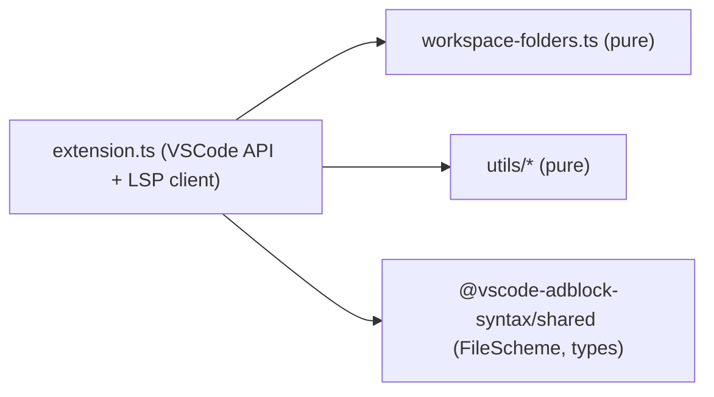

<!-- omit in toc -->
# AGENTS.md — client

Agent reference for the `@vscode-adblock-syntax/client` package: the VSCode
extension entry point and Language Server Protocol (LSP) client.

This is part of a monorepo. For repo-wide conventions (dependency management,
Markdown formatting, versioning, contribution rules) see the root
[AGENTS.md](../AGENTS.md). For environment setup see
[DEVELOPMENT.md](../DEVELOPMENT.md).

<!-- omit in toc -->
## Table of Contents

- [Project Overview](#project-overview)
- [Technical Context](#technical-context)
- [Project Structure](#project-structure)
- [Contribution Instructions](#contribution-instructions)
- [Code Guidelines](#code-guidelines)
    - [System Design](#system-design)
    - [Architecture](#architecture)
    - [Code Quality](#code-quality)
    - [Testing](#testing)
    - [Dependency Management](#dependency-management)
    - [Configuration \& Documentation](#configuration--documentation)
    - [Markdown Formatting](#markdown-formatting)
- [Related Agents](#related-agents)

## Project Overview

The client is the VSCode-facing half of the extension. It activates the
extension, spins up one language client (and a separate server process) per
outermost workspace folder, manages their lifecycle, mirrors AGLint status in
the status bar, and forwards document/configuration events to the server over
LSP. It holds **all** direct VSCode API access; linting logic lives in the
[server](../server/AGENTS.md).

## Technical Context

- **Language/Version**: TypeScript targeting `ESNext` (see
  [tsconfig.base.json](../tsconfig.base.json)), `strict` mode.
- **Runtime**: VSCode extension host (Node.js), VSCode `^1.74.0`.
- **Primary Dependencies**: `vscode-languageclient` (LSP client),
  `@vscode-adblock-syntax/shared` (shared types), `valibot` (validation),
  `vscode` API (provided by the host).
- **Storage**: None — in-memory maps of clients and per-folder status.
- **Testing**: Vitest, with a mocked `vscode` module.
- **Build**: Rspack, output to `out/` (root `package.json` `main` points to
  `./client/out/extension`).
- **Project Type**: monorepo package (VSCode extension entry).

## Project Structure

```text
client/
├── package.json                  # Package manifest and scripts
├── rspack.config.ts              # Bundler config (output to out/)
├── src/
│   ├── extension.ts              # Entry point: activate/deactivate, LSP client lifecycle
│   ├── constants.ts              # Client IDs, language ID, file extensions, status bar config
│   ├── workspace-folders.ts      # Outermost-folder resolution, file-in-folder checks
│   └── utils/
│       ├── log-level.ts          # Maps VSCode log level → AGLint debug flag
│       └── status-parser.ts      # Parses aglint/status notification params
└── tests/
    ├── __mocks__/vscode.ts       # Mock VSCode API for tests
    ├── workspace-folders.test.ts
    └── utils/                    # Unit tests mirroring src/utils
```

## Contribution Instructions

After completing a task, you MUST do the following:

- Verify your changes with the linter and type checker:
    - `pnpm --filter @vscode-adblock-syntax/client exec tsc --noEmit` for type
      errors.
    - `pnpm --filter @vscode-adblock-syntax/client lint:code` (add `--fix` to
      auto-fix) for ESLint.
    - `pnpm --filter @vscode-adblock-syntax/client lint:md` for Markdown.
- Update or add Vitest unit tests for any changed code.
- Run `pnpm --filter @vscode-adblock-syntax/client test` and ensure all tests
  pass.
- When you change this package's structure, update the
  [Project Structure](#project-structure) section above.
- If a prompt asks you to refactor or improve code, capture the lesson as a
  guideline under [Code Guidelines](#code-guidelines).
- Verify new code follows these Code Guidelines and the root
  [AGENTS.md](../AGENTS.md).

## Code Guidelines

### System Design

Design for the VSCode extension host:

- Keep all VSCode API usage in this package; never duplicate it in the server.
- Communicate with the server only over LSP (requests, notifications,
  middleware). Do not share mutable state across the process boundary.
- Create one client/server pair per **outermost** workspace folder (use
  `getOuterMostWorkspaceFolder`); a dedicated default client handles untitled
  documents. Dispose clients and their stored status when a folder is removed.
- React to events (document open/change/save, active editor change, workspace
  folder change, log-level change) asynchronously; never block the extension
  host.
- Keep activation fast and the bundle small; defer heavy work to the server
  process.

### Architecture

The client is a thin VSCode integration layer. Principles:

- **Separation of Concerns** — `extension.ts` orchestrates lifecycle;
  `workspace-folders.ts` handles folder math; `utils/` handles pure
  transformations (log level, status parsing).
- **Single Responsibility** — keep pure helpers (status parsing, log-level
  mapping) free of VSCode API calls so they stay unit-testable.
- **Dependency Direction** — depend only on `vscode`, `vscode-languageclient`,
  and `@vscode-adblock-syntax/shared`; never import from `server`.
- **Explicit Boundaries** — the only channel to the server is LSP; the only
  channel to the user is the VSCode API (status bar, output channels).
- **Data Flow Clarity** — document events → middleware filter (file-in-folder)
  → server; `aglint/status` notifications → status bar.
- **Make Invalid States Impossible** — validate notification payloads
  (`parseStatusParams`) before using them.
- **Observability Built-in** — each client gets a VSCode `LogOutputChannel`,
  making it visible under "Developer: Set Log Level".

Layers:

| Layer | Responsibility | Example |
| --- | --- | --- |
| Activation/lifecycle | Create, start, dispose clients | [src/extension.ts](src/extension.ts) |
| Workspace logic | Outermost folder, file containment | [src/workspace-folders.ts](src/workspace-folders.ts) |
| Pure utilities | Log level, status parsing | [src/utils/status-parser.ts](src/utils/status-parser.ts) |

Dependency flow:



### Code Quality

- Follow the root [Code Quality](../AGENTS.md#code-quality) rules: required
  JSDoc, 4-space indent, max line length 120, grouped/alphabetized imports,
  inline type imports.
- Keep VSCode API calls out of pure helpers so they can be tested with the
  mocked `vscode` module.
- Swallow only expected errors (e.g. notifications sent before the server is
  ready) and document why.

### Testing

- Vitest tests live in [tests/](tests) and mirror `src/`.
- The VSCode API is mocked in [tests/\_\_mocks\_\_/vscode.ts](tests/__mocks__/vscode.ts);
  pure helpers are tested directly.
- Add tests for new folder-resolution logic, status parsing, and log-level
  mapping. All tests must pass before completing a task.

### Dependency Management

Follow the root [Dependency Management](../AGENTS.md#dependency-management)
rules. Add dependencies via the workspace `catalog`; keep the client bundle
small because its size affects extension activation time.

### Configuration & Documentation

- The client reads VSCode settings indirectly: it passes initialization options
  (workspace folder, debug flag) to the server, which fetches
  `adblock.*` settings. Update [src/constants.ts](src/constants.ts) when IDs,
  watched file patterns, or supported extensions change.
- When the client/server protocol or activation behavior changes, update this
  file and the root [AGENTS.md](../AGENTS.md).

### Markdown Formatting

Follow the root [Markdown Formatting](../AGENTS.md#markdown-formatting) rules
(max line length 120, dash bullets, 4-space nested indent, asterisk emphasis,
limited inline HTML).

## Related Agents

- Root: [AGENTS.md](../AGENTS.md)
- Server: [server/AGENTS.md](../server/AGENTS.md)
- Shared: [shared/AGENTS.md](../shared/AGENTS.md)
