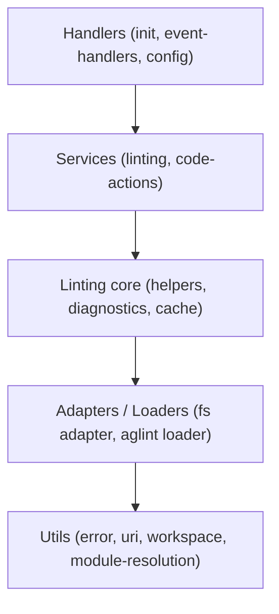

<!-- omit in toc -->
# AGENTS.md — server

Agent reference for the `@vscode-adblock-syntax/server` package: the Language
Server Protocol (LSP) server that integrates AGLint to provide diagnostics and
code actions.

This is part of a monorepo. For repo-wide conventions (dependency management,
Markdown formatting, versioning, contribution rules) see the root
[AGENTS.md](../AGENTS.md). For environment setup see
[DEVELOPMENT.md](../DEVELOPMENT.md).

<!-- omit in toc -->
## Table of Contents

- [Project Overview](#project-overview)
- [Technical Context](#technical-context)
- [Project Structure](#project-structure)
- [Contribution Instructions](#contribution-instructions)
- [Code Guidelines](#code-guidelines)
    - [System Design](#system-design)
    - [Architecture](#architecture)
    - [Code Quality](#code-quality)
    - [Testing](#testing)
    - [Dependency Management](#dependency-management)
    - [Configuration \& Documentation](#configuration--documentation)
    - [Markdown Formatting](#markdown-formatting)
    - [Other](#other)
- [Related Agents](#related-agents)

## Project Overview

The server runs as a separate Node.js process, one per outermost workspace
folder, and speaks LSP to the [client](../client/AGENTS.md). It dynamically
locates and loads AGLint from the user's workspace (local or global install),
lints filter-list documents, converts AGLint problems into VSCode diagnostics,
and offers code actions (apply fix, apply suggestion, disable a rule). All state
is held in memory and the server degrades gracefully if AGLint cannot be loaded.

## Technical Context

- **Language/Version**: TypeScript targeting `ESNext`, `strict` mode.
- **Runtime**: Node.js `>=20` (the LSP server process).
- **Primary Dependencies**: `vscode-languageserver`,
  `vscode-languageserver-textdocument`, `vscode-uri`,
  `@vscode-adblock-syntax/shared`; `fast-glob`, `resolve`, `preferred-pm`,
  `semver`, `debounce`, `yaml`. `@adguard/aglint` and `@adguard/agtree` are
  type-only/dev dependencies — AGLint is loaded from the user's workspace at
  runtime, not bundled.
- **Storage**: None — in-memory `ServerContext`, `AglintContext`, and an LRU
  diagnostics cache.
- **Testing**: Vitest (with `@vitest/coverage-v8`).
- **Build**: Rspack with code splitting; output to `out/server.js`.
- **Project Type**: monorepo package (LSP server).

## Project Structure

```text
server/
├── package.json                        # Manifest and scripts
├── rspack.config.ts                    # Bundler config (code splitting)
├── src/
│   ├── server.ts                       # Entry point: LSP connection, ServerContext, handler wiring
│   ├── settings.ts                     # ExtensionSettings interface
│   ├── handlers/                       # LSP event entry points
│   │   ├── initialization.ts           # onInitialize: capabilities, workspace root
│   │   ├── event-handlers.ts           # Registers document/config/watch/log-level listeners
│   │   └── configuration.ts            # Settings fetch, AGLint context (re)initialization
│   ├── context/                        # Centralized state containers
│   │   ├── server-context.ts           # All mutable server state (connection, docs, cache, flags)
│   │   └── aglint-context.ts           # AGLint module, debugger, fs/path adapters, linter tree
│   ├── linting/                        # Linting orchestration and caching
│   │   ├── orchestration.ts            # Public APIs: lintFile, refreshLinter, debounce, config
│   │   ├── helpers.ts                  # shouldLintDocument, performLinting, cache lookup
│   │   ├── diagnostics.ts              # AGLint result → VSCode diagnostic conversion
│   │   └── cache.ts                    # LRU diagnostics cache (version/config-keyed)
│   ├── code-actions/                   # Quick fixes and suggestions
│   │   ├── index.ts                    # Code action request entry/router
│   │   ├── fix-actions.ts              # Fix + suggestion code actions
│   │   ├── disable-rule.ts             # Disable-rule / disable-next-line actions
│   │   └── utils.ts                    # Range/offset/fix conversion helpers
│   ├── loaders/aglint.ts               # Dynamic AGLint resolution, version check, import
│   ├── adapters/fs.ts                  # LSPFileSystemAdapter (AGLint fs over LSP docs + disk)
│   ├── common/constants.ts             # AGLint package name, repo URL, char constants
│   └── utils/                          # Low-level helpers
│       ├── error.ts                    # getErrorMessage, getErrorStack
│       ├── uri.ts                      # isFileUri
│       ├── workspace.ts                # extractWorkspaceRootUri, root-from-rootUri
│       ├── file-exists.ts              # Async existence check
│       ├── module-resolver.ts          # resolveModulePath (local/global packages)
│       ├── package-managers.ts         # npm/yarn/pnpm/bun global root discovery
│       └── import.ts                   # Dynamic import wrapper
└── test/                               # Vitest tests mirroring src/ (+ helpers/mocks.ts)
```

## Contribution Instructions

After completing a task, you MUST do the following:

- Verify your changes with the linter and type checker:
    - `pnpm --filter @vscode-adblock-syntax/server exec tsc --noEmit` for type
      errors.
    - `pnpm --filter @vscode-adblock-syntax/server lint:code` (add `--fix`) for
      ESLint.
    - `pnpm --filter @vscode-adblock-syntax/server lint:md` for Markdown.
- Update or add Vitest unit tests for any changed code.
- Run `pnpm --filter @vscode-adblock-syntax/server test` and ensure all tests
  pass.
- When you change this package's structure, update the
  [Project Structure](#project-structure) section above.
- If a prompt asks you to refactor or improve code, capture the lesson as a
  guideline under [Code Guidelines](#code-guidelines).
- Verify new code follows these Code Guidelines and the root
  [AGENTS.md](../AGENTS.md).

## Code Guidelines

### System Design

Design for a long-lived LSP server process:

- The server is a long-running process (one per outermost workspace folder).
  Clean up resources (watchers, debounced timers, AGLint handles) proactively;
  do not rely on process exit.
- Handlers are request/notification entry points — keep them thin and delegate
  business logic to the linting and code-action layers. Treat handlers like
  route controllers: validate input, call a service, return a response.
- Hold all mutable state in `ServerContext` (and AGLint specifics in
  `AglintContext`); do not introduce module-level singletons or shared mutable
  globals.
- Initialize AGLint lazily and tolerate failure: if AGLint cannot be resolved,
  log, notify the client via `aglint/status`, send no diagnostics, and retry
  when `package.json` / `node_modules` change. Never crash the server.
- Debounce document linting (100 ms) to avoid thrashing; trigger an immediate
  full refresh on configuration changes.
- Decouple AGLint from the LSP runtime through `adapters/fs.ts` — AGLint always
  goes through the adapter, which prefers in-memory LSP documents over disk.

### Architecture

Universal principles applied here:

- **Separation of Concerns** — handlers (LSP entry), linting (business logic),
  loaders/adapters (integration), utils (infrastructure) are distinct layers.
- **Single Responsibility** — each module owns one job (e.g. `cache.ts` only
  caches; `diagnostics.ts` only converts).
- **Dependency Direction** — handlers → linting/code-actions → adapters/loaders
  → utils. Lower layers never import higher ones. `ServerContext`/`AglintContext`
  flow downward as arguments.
- **Explicit Boundaries** — `linting/orchestration.ts` is the public linting
  API; `helpers.ts` and `cache.ts` are internal. `LSPFileSystemAdapter` does not
  leak AGLint types upward.
- **Data Flow Clarity** — document change → `shouldLintDocument` → cache lookup
  → `performLinting` (AGLint) → `convertLinterResultToDiagnostics` → publish.
- **Minimize Coupling, Maximize Cohesion** — AGLint integration is isolated in
  `loaders/`, `adapters/`, and `context/aglint-context.ts`.
- **Make Invalid States Impossible** — validate the AGLint version
  (`>= 4.0.0-beta.1`) before use; type LSP payloads and settings.
- **Observability Built-in** — log through the LSP connection console with
  prefixes (`[lsp]`, `[aglint]`); surface state to the client through the
  `aglint/status` notification.
- **Keep It Boring** — follow standard LSP server patterns.

Layers (top to bottom):

| Layer | Responsibility | Examples |
| --- | --- | --- |
| Handlers | LSP lifecycle and event entry points | [src/handlers/event-handlers.ts](src/handlers/event-handlers.ts) |
| Services | Linting orchestration, code actions | [src/linting/orchestration.ts](src/linting/orchestration.ts), [src/code-actions/index.ts](src/code-actions/index.ts) |
| Linting core | Internal lint helpers, diagnostics, cache | [src/linting/helpers.ts](src/linting/helpers.ts), [src/linting/cache.ts](src/linting/cache.ts) |
| Adapters/Loaders | AGLint module loading, filesystem adapter | [src/loaders/aglint.ts](src/loaders/aglint.ts), [src/adapters/fs.ts](src/adapters/fs.ts) |
| Utils | URI, workspace, module resolution, errors | [src/utils/module-resolver.ts](src/utils/module-resolver.ts) |

Dependency flow:



`ServerContext` and `AglintContext` are passed downward; no layer depends on a
layer above it.

### Code Quality

- Follow the root [Code Quality](../AGENTS.md#code-quality) rules: required
  JSDoc, 4-space indent, max line length 120, grouped/alphabetized imports,
  inline type imports.
- **AGLint imports**: only `type` imports from `@adguard/aglint` are allowed
  (enforced by `@typescript-eslint/no-restricted-imports` in
  [.eslintrc.cjs](.eslintrc.cjs)). The runtime AGLint module must be obtained
  through `loaders/aglint.ts`, never imported directly.
- **Error handling**: low-level helpers throw; orchestration/handlers catch,
  log, and degrade (return `undefined`, publish empty diagnostics). Use
  `getErrorMessage` / `getErrorStack` to read `unknown` errors. Use `undefined`
  for "not found" and `null` for "parse failed" consistently.
- **Logging**: use connection console with prefixes `[lsp]` and `[aglint]`;
  pick the level (`info`/`debug`/`warn`/`error`) by significance.
- **Naming**: verb-prefixed functions (`lintFile`, `ensureAglintContext`),
  `PascalCase` types/contexts, `UPPER_SNAKE_CASE` constants
  (`LINT_FILE_DEBOUNCE_DELAY`, `CACHE_MAX_ENTRIES`).

### Testing

- Vitest tests live in [test/](test) and mirror `src/`.
- Mock LSP boundaries with the factories in
  [test/helpers/mocks.ts](test/helpers/mocks.ts) (`createMockConnection`,
  `createMockServerContext`). Test pure logic (cache keys, diagnostic
  conversion, config-comment parsing) directly without mocks.
- Add tests when changing cache keying, diagnostic conversion, or code-action
  generation. All tests must pass before completing a task.

### Dependency Management

Follow the root [Dependency Management](../AGENTS.md#dependency-management)
rules. Keep AGLint a type-only/dev dependency — it is resolved from the user's
workspace at runtime via `loaders/aglint.ts`, not bundled into the server.

### Configuration & Documentation

- Runtime settings (`adblock.enableAglint`,
  `adblock.enableInMemoryAglintCache`) are fetched from the client and typed by
  [src/settings.ts](src/settings.ts). AGLint configuration comes from the user's
  `.aglintrc.*` files, read through the filesystem adapter.
- When you change the settings schema, the `aglint/status` protocol, or the
  AGLint version requirement, update this file, [src/settings.ts](src/settings.ts),
  the root [package.json](../package.json) `contributes.configuration`, and the
  root [AGENTS.md](../AGENTS.md).

### Markdown Formatting

Follow the root [Markdown Formatting](../AGENTS.md#markdown-formatting) rules.

### Other

- **Minimum AGLint version**: `4.0.0-beta.1`. Reject and report older versions
  rather than attempting to lint with them.
- **Graceful degradation is mandatory**: a missing or broken AGLint install must
  never crash the server or block syntax highlighting.

## Related Agents

- Root: [AGENTS.md](../AGENTS.md)
- Client: [client/AGENTS.md](../client/AGENTS.md)
- Shared: [shared/AGENTS.md](../shared/AGENTS.md)
