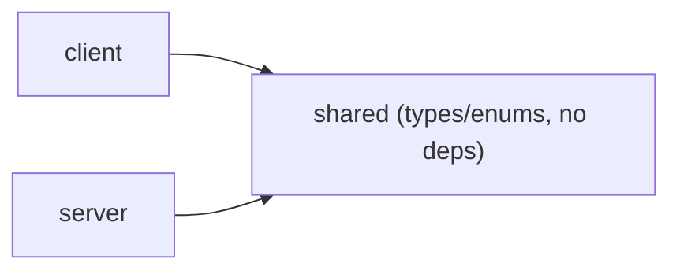

<!-- omit in toc -->
# AGENTS.md — shared

Agent reference for the `@vscode-adblock-syntax/shared` package: types and
utilities shared between the [client](../client/AGENTS.md) and
[server](../server/AGENTS.md).

This is part of a monorepo. For repo-wide conventions (dependency management,
Markdown formatting, versioning, contribution rules) see the root
[AGENTS.md](../AGENTS.md). For environment setup see
[DEVELOPMENT.md](../DEVELOPMENT.md).

<!-- omit in toc -->
## Table of Contents

- [Project Overview](#project-overview)
- [Technical Context](#technical-context)
- [Project Structure](#project-structure)
- [Contribution Instructions](#contribution-instructions)
- [Code Guidelines](#code-guidelines)
    - [System Design](#system-design)
    - [Architecture](#architecture)
    - [Code Quality](#code-quality)
    - [Testing](#testing)
    - [Dependency Management](#dependency-management)
    - [Configuration \& Documentation](#configuration--documentation)
    - [Markdown Formatting](#markdown-formatting)
- [Related Agents](#related-agents)

## Project Overview

A small internal library consumed by the client and server packages. It holds
contracts that must stay consistent across the process boundary: shared enums
and types (e.g. document `FileScheme`), and is the intended home for future
shared validation schemas (Valibot) and custom LSP protocol types. It performs
no I/O and has no side effects.

## Technical Context

- **Language/Version**: TypeScript targeting `ESNext`, `strict` mode.
- **Runtime**: Consumed by both the VSCode extension host (client) and the
  Node.js LSP server; Node `>=20`.
- **Primary Dependencies**: None at runtime (utility code only).
- **Storage**: None.
- **Testing**: Vitest (`test/` currently a placeholder).
- **Build**: Rspack for the bundle plus `tsc --emitDeclarationOnly` for type
  declarations; published via `exports` from `out/index.js` / `out/index.d.ts`.
- **Project Type**: monorepo package (internal library).

## Project Structure

```text
shared/
├── package.json          # Manifest, exports map, build (rspack + tsc dts)
├── rspack.config.ts      # Bundler config
├── src/
│   ├── index.ts          # Public entry point (re-exports the public API)
│   └── file-scheme.ts    # FileScheme enum (file, untitled)
└── test/                 # Vitest tests (placeholder)
```

## Contribution Instructions

After completing a task, you MUST do the following:

- Verify your changes with the linter and type checker:
    - `pnpm --filter @vscode-adblock-syntax/shared exec tsc --noEmit` for type
      errors.
    - `pnpm --filter @vscode-adblock-syntax/shared lint:code` (add `--fix`) for
      ESLint.
    - `pnpm --filter @vscode-adblock-syntax/shared lint:md` for Markdown.
- Update or add Vitest unit tests for any changed code.
- Run `pnpm --filter @vscode-adblock-syntax/shared test` and ensure all tests
  pass.
- When you change this package's structure, update the
  [Project Structure](#project-structure) section above.
- If a prompt asks you to refactor or improve code, capture the lesson as a
  guideline under [Code Guidelines](#code-guidelines).
- Verify new code follows these Code Guidelines and the root
  [AGENTS.md](../AGENTS.md).

## Code Guidelines

### System Design

Design as a consumed library:

- The library is imported by other packages — never access the filesystem,
  network, or environment, and keep side effects out of the default code path.
- Export a stable public API only through [src/index.ts](src/index.ts). Anything
  not re-exported there is internal.
- Keep the dependency footprint at zero where possible — every dependency here
  becomes a transitive dependency of both client and server. Prefer built-in
  APIs.
- Do not mutate global state; both consumers are long-running processes.
- Provide complete type definitions (the package ships `.d.ts`) so consumers get
  type checking and autocompletion.
- Document every exported function, class, and type with JSDoc.

### Architecture

This package is a single, dependency-free utility layer at the bottom of the
monorepo dependency graph.

- **Separation of Concerns** — one concept per file (e.g.
  [src/file-scheme.ts](src/file-scheme.ts)).
- **Single Responsibility** — each export has one reason to change.
- **Dependency Direction** — depends on nothing inside the repo; client and
  server depend on it. Never import from `client` or `server`.
- **Explicit Boundaries** — the public surface is exactly what
  [src/index.ts](src/index.ts) re-exports.
- **Data Flow Clarity** — pure values and types only; no hidden state.
- **Make Invalid States Impossible** — model shared contracts as precise types
  and enums (this is the intended home for shared Valibot schemas).
- **Keep It Boring** — small, obvious, well-typed helpers.

Dependency flow:



### Code Quality

- Follow the root [Code Quality](../AGENTS.md#code-quality) rules: required
  JSDoc, 4-space indent, max line length 120, grouped/alphabetized imports,
  inline type imports.
- Re-export the public API only from [src/index.ts](src/index.ts); keep
  implementation files focused and free of cross-cutting concerns.

### Testing

- Vitest tests live in [test/](test). The directory is currently a placeholder;
  add tests as real logic (e.g. validation schemas) is introduced.
- All tests must pass before completing a task.

### Dependency Management

Follow the root [Dependency Management](../AGENTS.md#dependency-management)
rules. Because every dependency here is inherited by both client and server,
keep this package dependency-free unless a dependency is clearly justified.

### Configuration & Documentation

- This package has no runtime configuration. When you add to the public API,
  update the `exports`/types in [package.json](package.json) if needed, the
  [Project Structure](#project-structure) section above, and note shared
  contracts in the root [AGENTS.md](../AGENTS.md).

### Markdown Formatting

Follow the root [Markdown Formatting](../AGENTS.md#markdown-formatting) rules.

## Related Agents

- Root: [AGENTS.md](../AGENTS.md)
- Client: [client/AGENTS.md](../client/AGENTS.md)
- Server: [server/AGENTS.md](../server/AGENTS.md)
