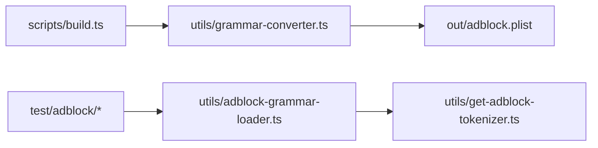

<!-- omit in toc -->
# AGENTS.md — syntaxes

Agent reference for the `@vscode-adblock-syntax/syntaxes` package: the TextMate
grammar source for adblock filter syntax, its compiler, and its tokenization
tests.

This is part of a monorepo. For repo-wide conventions (dependency management,
Markdown formatting, versioning, contribution rules) see the root
[AGENTS.md](../AGENTS.md). For environment setup see
[DEVELOPMENT.md](../DEVELOPMENT.md).

<!-- omit in toc -->
## Table of Contents

- [Project Overview](#project-overview)
- [Technical Context](#technical-context)
- [Project Structure](#project-structure)
- [Contribution Instructions](#contribution-instructions)
- [Code Guidelines](#code-guidelines)
    - [System Design](#system-design)
    - [Architecture](#architecture)
    - [Code Quality](#code-quality)
    - [Testing](#testing)
    - [Dependency Management](#dependency-management)
    - [Configuration \& Documentation](#configuration--documentation)
    - [Markdown Formatting](#markdown-formatting)
- [Related Agents](#related-agents)

## Project Overview

This package owns the syntax highlighting grammar. The grammar is authored in
YAML ([adblock.yaml-tmlanguage](adblock.yaml-tmlanguage)) and compiled to a
TextMate PList (`out/adblock.plist`) that the root extension contributes to
VSCode (and that GitHub Linguist uses for highlighting). It also provides a
tokenization test harness that loads the real grammar with `vscode-textmate` +
`vscode-oniguruma` and asserts token scopes for sample rules.

## Technical Context

- **Language/Version**: TypeScript (build/test scripts) targeting `ESNext`;
  grammar authored in YAML.
- **Runtime**: Node.js (build and test only — the compiled grammar runs inside
  VSCode/Linguist, not this package).
- **Primary Dependencies**: `vscode-textmate`, `vscode-oniguruma` (tokenization),
  `plist`, `yaml` (grammar conversion), `chokidar` (watch), `fast-glob`,
  `fs-extra`, `chalk`, `tar`, `valibot`.
- **Storage**: None — reads the YAML grammar, writes a PList artifact to `out/`.
- **Testing**: Vitest with a custom tokenization matcher.
- **Build**: `tsx scripts/build.ts` (YAML → PList; supports `--watch`).
- **Project Type**: monorepo package (grammar source + build/test tooling).

## Project Structure

```text
syntaxes/
├── package.json                    # Manifest and scripts
├── adblock.yaml-tmlanguage         # Source grammar (YAML TextMate)
├── scripts/
│   └── build.ts                    # Compiles YAML grammar → out/adblock.plist (--watch supported)
├── utils/                          # Grammar + tokenizer helpers
│   ├── grammar-converter.ts        # convertYamlToPlist
│   ├── adblock-grammar-loader.ts   # Loads compiled grammar for tests
│   ├── get-adblock-tokenizer.ts    # Builds a tokenizer via vscode-textmate/oniguruma
│   ├── constants.ts                # Scope names, paths
│   ├── error.ts                    # getErrorMessage
│   └── utils.ts                    # Misc helpers
├── test/                           # Tokenization tests
│   ├── integration.ts              # Integration entry (downloads real-world filter lists)
│   ├── adblock/                    # Scope assertions by rule category (comments, cosmetic, network)
│   └── setup/custom-matchers/      # expect-tokenization matcher
└── typings/                        # Vitest custom matcher type declarations
```

## Contribution Instructions

After completing a task, you MUST do the following:

- Verify your changes with the linter and type checker:
    - `pnpm --filter @vscode-adblock-syntax/syntaxes exec tsc --noEmit` for type
      errors.
    - `pnpm --filter @vscode-adblock-syntax/syntaxes lint:code` (add `--fix`) for
      ESLint.
    - `pnpm --filter @vscode-adblock-syntax/syntaxes lint:md` for Markdown.
- When you change the grammar, rebuild it and update or add tokenization tests
  under [test/adblock/](test/adblock); add or modify example rules in
  [test/static/rules](../test/static/rules) for visual verification.
- Run `pnpm --filter @vscode-adblock-syntax/syntaxes test` and ensure all tests
  pass.
- When you change this package's structure, update the
  [Project Structure](#project-structure) section above.
- If a prompt asks you to refactor or improve code, capture the lesson as a
  guideline under [Code Guidelines](#code-guidelines).
- Verify new code follows these Code Guidelines and the root
  [AGENTS.md](../AGENTS.md).

## Code Guidelines

### System Design

Design as a build/library package that produces a consumed artifact:

- The compiled grammar (`out/adblock.plist`) is the public artifact — keep it
  reproducible from the YAML source via `scripts/build.ts`. Never hand-edit the
  PList; edit the YAML and rebuild.
- Build and test scripts run and exit. Validate inputs early (the source grammar
  must exist and be valid YAML) and fail with a clear, located error message
  (e.g. `file:line:col`).
- Keep the grammar self-contained; embedded languages (JavaScript for
  scriptlets) are declared via scope mapping, not by importing other grammars.
- Keep tooling dependencies in `devDependencies` — nothing here ships in the
  extension bundle except the generated PList.

### Architecture

- **Separation of Concerns** — the grammar source (YAML), the converter
  (`utils/grammar-converter.ts`), the build entry (`scripts/build.ts`), and the
  test tokenizer (`utils/get-adblock-tokenizer.ts`) are distinct.
- **Single Responsibility** — conversion, loading, and tokenization each live in
  their own module.
- **Dependency Direction** — `scripts/` and `test/` depend on `utils/`; `utils/`
  modules do not depend on scripts or tests. No cross-package imports.
- **Explicit Boundaries** — the build consumes one input (the YAML grammar) and
  produces one output (the PList).
- **Data Flow Clarity** — YAML → `convertYamlToPlist` → PList; PList →
  `adblock-grammar-loader` → `get-adblock-tokenizer` → scope assertions.
- **Make Invalid States Impossible** — invalid YAML is rejected at build time
  with a precise error.
- **Keep It Boring** — standard TextMate grammar patterns and well-known
  tokenization libraries.

Dependency flow:



### Code Quality

- Follow the root [Code Quality](../AGENTS.md#code-quality) rules: required
  JSDoc, 4-space indent, max line length 120, grouped/alphabetized imports,
  inline type imports.
- Use the local `getErrorMessage` helper to read `unknown` errors; report
  grammar errors with file/line/column context.
- Keep regular expressions in the grammar readable and documented; prefer named
  captures and clear scope names.

### Testing

- Vitest tokenization tests live in [test/adblock/](test/adblock), grouped by
  rule category (comments, cosmetic, network). They tokenize sample rules with
  the real grammar and assert scopes via the custom `expect-tokenization`
  matcher in [test/setup/custom-matchers](test/setup/custom-matchers).
- The grammar must be built before tokenization tests can load it.
- Add or update tests whenever you change a grammar rule. All tests must pass
  before completing a task.

### Dependency Management

Follow the root [Dependency Management](../AGENTS.md#dependency-management)
rules. All dependencies here are build/test-only (`devDependencies`); do not add
runtime dependencies to this package.

### Configuration & Documentation

- The grammar's scope name (`text.adblock`), output path
  (`syntaxes/out/adblock.plist`), and embedded-language mapping are wired up in
  the root [package.json](../package.json) `contributes.grammars`. Update that
  manifest and the root [AGENTS.md](../AGENTS.md) if scope names or output paths
  change.
- When updating syntax highlighting, follow the "Updating the grammar" steps in
  [DEVELOPMENT.md](DEVELOPMENT.md).

### Markdown Formatting

Follow the root [Markdown Formatting](../AGENTS.md#markdown-formatting) rules.

## Related Agents

- Root: [AGENTS.md](../AGENTS.md)
- Tools: [tools/AGENTS.md](../tools/AGENTS.md)
