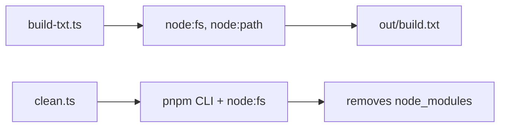

<!-- omit in toc -->
# AGENTS.md — tools

Agent reference for the `@vscode-adblock-syntax/tools` package: repository-wide
build and utility scripts.

This is part of a monorepo. For repo-wide conventions (dependency management,
Markdown formatting, versioning, contribution rules) see the root
[AGENTS.md](../AGENTS.md). For environment setup see
[DEVELOPMENT.md](../DEVELOPMENT.md).

<!-- omit in toc -->
## Table of Contents

- [Project Overview](#project-overview)
- [Technical Context](#technical-context)
- [Project Structure](#project-structure)
- [Contribution Instructions](#contribution-instructions)
- [Code Guidelines](#code-guidelines)
    - [System Design](#system-design)
    - [Architecture](#architecture)
    - [Code Quality](#code-quality)
    - [Testing](#testing)
    - [Dependency Management](#dependency-management)
    - [Configuration \& Documentation](#configuration--documentation)
    - [Markdown Formatting](#markdown-formatting)
- [Related Agents](#related-agents)

## Project Overview

A collection of small, standalone Node.js scripts used by the repo's build and
maintenance workflows. Currently:

- [build-txt.ts](build-txt.ts) — writes the extension version from the root
  `package.json` into `out/build.txt` (used by CI/packaging).
- [clean.ts](clean.ts) — dependency-free cleanup that removes `node_modules`
  from every workspace package.

These scripts are invoked from the repo root (e.g. `pnpm clean`) and run via
`tsx`. The package has no build step of its own.

## Technical Context

- **Language/Version**: TypeScript run directly with `tsx`; CommonJS-style
  scripts (`__dirname`, `node:` built-ins).
- **Runtime**: Node.js (run-and-exit scripts).
- **Primary Dependencies**: None — the scripts rely on Node.js built-ins
  (`node:fs`, `node:path`, `node:child_process`) and the `pnpm` CLI.
- **Storage**: Filesystem only (writes `out/build.txt`, removes `node_modules`).
- **Testing**: None currently (no test runner configured for this package).
- **Build**: None — scripts are executed in place via `tsx`.
- **Project Type**: monorepo package (CLI/utility scripts).

## Project Structure

```text
tools/
├── package.json          # Minimal manifest (no build/test scripts)
├── tsconfig.json         # TypeScript config for the scripts
├── build-txt.ts          # Writes version → out/build.txt
└── clean.ts              # Removes node_modules from all workspace packages
```

## Contribution Instructions

After completing a task, you MUST do the following:

- Verify your changes with the linter and type checker:
    - `pnpm test:compile` (from the root) for TypeScript type errors.
    - `pnpm lint:code` (from the root, add `--fix`) for ESLint.
    - `pnpm lint:md` (from the root) for Markdown.
- Add unit tests if a script grows non-trivial logic worth covering (no test
  runner is configured here yet; prefer keeping scripts simple).
- Run `pnpm test` from the root and ensure all tests pass.
- When you add or remove a script, update the
  [Project Structure](#project-structure) and
  [Project Overview](#project-overview) sections above.
- If a prompt asks you to refactor or improve code, capture the lesson as a
  guideline under [Code Guidelines](#code-guidelines).
- Verify new code follows these Code Guidelines and the root
  [AGENTS.md](../AGENTS.md).

## Code Guidelines

### System Design

Design as run-and-exit command-line scripts:

- Each script performs its work and exits — no long-lived state, no daemons.
  Exit non-zero on failure (e.g. [clean.ts](clean.ts) calls `process.exit(1)` on
  error).
- Use stdout for normal progress output and stderr for diagnostics and errors.
- Fail fast with clear messages: validate required inputs early (e.g.
  [build-txt.ts](build-txt.ts) throws if `package.json` has no `version`).
- Keep startup fast and dependencies minimal — prefer Node.js built-ins so
  cleanup-style scripts can run even when package `node_modules` are absent.

### Architecture

These are independent, single-file scripts with no shared internal layering.

- **Separation of Concerns** — one script per task (versioning, cleanup).
- **Single Responsibility** — each file does exactly one job.
- **Dependency Direction** — scripts depend only on Node.js built-ins and CLI
  tools (`pnpm`); they do not import from other workspace packages.
- **Explicit Boundaries** — interaction with the repo is through the filesystem
  and the `pnpm` CLI, not through package imports.
- **Data Flow Clarity** — read input (package.json / `pnpm ls`), perform an
  action (write file / remove dirs), exit.
- **Keep It Boring** — plain, dependency-free Node.js scripts.

Dependency flow:



### Code Quality

- Follow the root [Code Quality](../AGENTS.md#code-quality) rules: required
  JSDoc, 4-space indent, max line length 120, grouped/alphabetized imports,
  inline type imports.
- `console` output is expected in these scripts; where ESLint's `no-console`
  applies, disable it locally with an explanatory comment (as the existing
  scripts do) rather than globally.
- Handle filesystem and child-process errors explicitly and exit with a
  non-zero code on failure.

### Testing

- No test runner is configured for this package. Keep scripts simple enough that
  manual verification (running the script) is sufficient. If a script grows
  complex logic, extract the logic into a testable function before adding a test
  setup.

### Dependency Management

Follow the root [Dependency Management](../AGENTS.md#dependency-management)
rules. Keep this package dependency-free: prefer Node.js built-ins so that
maintenance scripts (especially cleanup) do not themselves depend on installed
`node_modules`.

### Configuration & Documentation

- These scripts read configuration from the repo (root `package.json` version,
  `pnpm ls` output); they take no environment variables or config files of their
  own. When a script's inputs or outputs change (e.g. the `build.txt` location),
  update this file and any CI configuration that consumes the output.

### Markdown Formatting

Follow the root [Markdown Formatting](../AGENTS.md#markdown-formatting) rules.

## Related Agents

- Root: [AGENTS.md](../AGENTS.md)
- Syntaxes: [syntaxes/AGENTS.md](../syntaxes/AGENTS.md)
